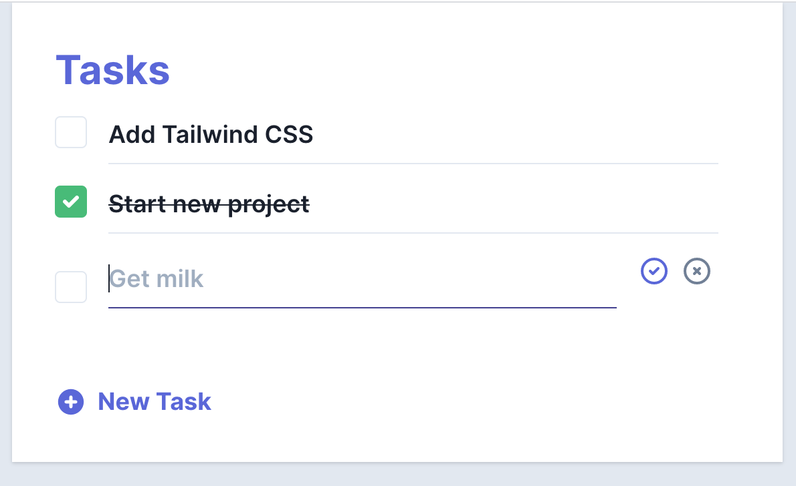

# Sample: Next.js + SWR + Tailwind + Amplify

Simple sample project exploring the use of [Next.js](https://nextjs.org), [SWR](https://swr.now.sh/), [Tailwind CSS](https://tailwindcss.com/), and [AWS Amplify](https://aws.amazon.com/amplify/).

In addition to learning more about Next and Tailwind, this project implements a basic approach to querying and mutating data in an [AWS AppSync](https://aws.amazon.com/appsync/) API using Vercel's SWR package (paging not implemented yet). This approach does not use AppSync Subscription capabilities.

## Getting Started

First, clone this repository:

``` bash
amplify init --app https://github.com/jkahn117/next-to-do
```

Use [Amplify Mocking](https://aws.amazon.com/blogs/aws/new-local-mocking-and-testing-with-the-amplify-cli/) to test the AWS AppSync API locally (no resources will be deployed to your AWS account):

``` bash
cd next-to-do

amplify mock
```

Once the mock server is running, start the development server:

```bash
npm run dev
# or
yarn dev
```

Open [http://localhost:3000](http://localhost:3000) to view the application:



## Future Work

Ran into issues including `createdAt` as a sort key for items in the list as this values is required by the mutation even though it is set in the AppSync Resolver. There is a [fix](https://github.com/aws-amplify/amplify-cli/pull/4382) in the works via the Amplify CLI. An alternative is an Amplify Plugin, [graphql-auto-transformer](https://github.com/hirochachacha/graphql-auto-transformer).

## Authors
* **Josh Kahn** - *Initial work*

